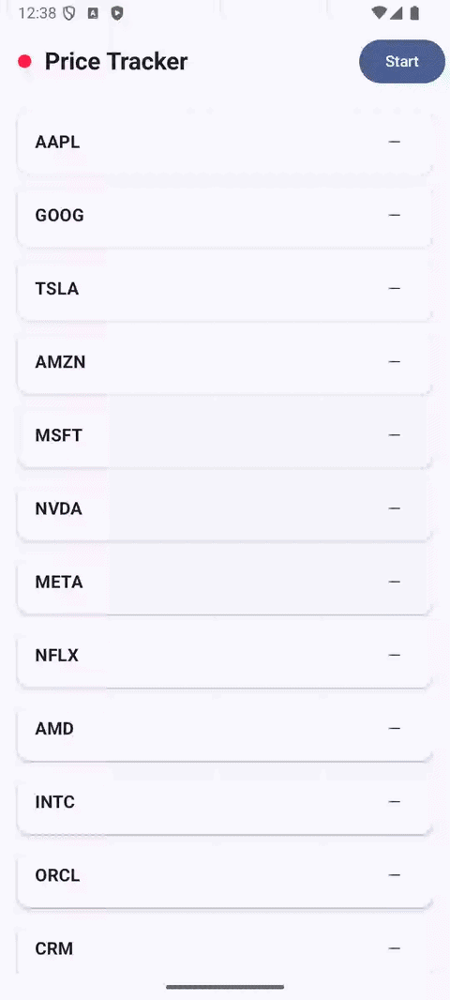
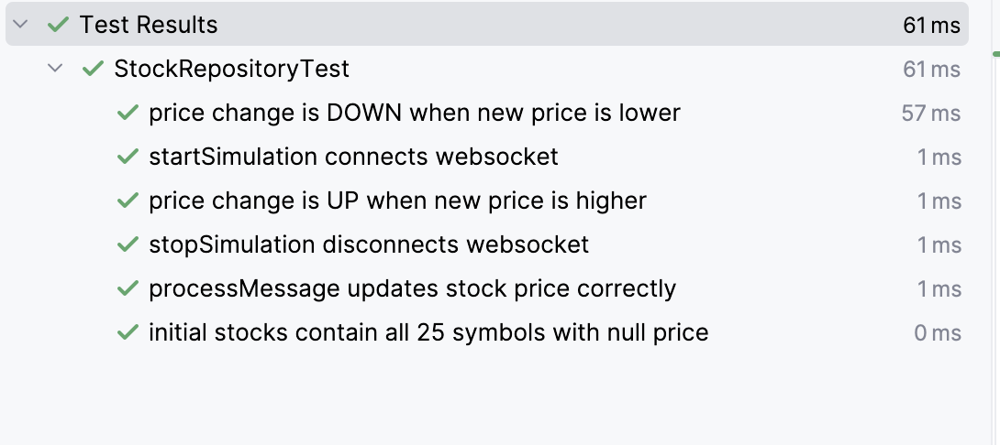
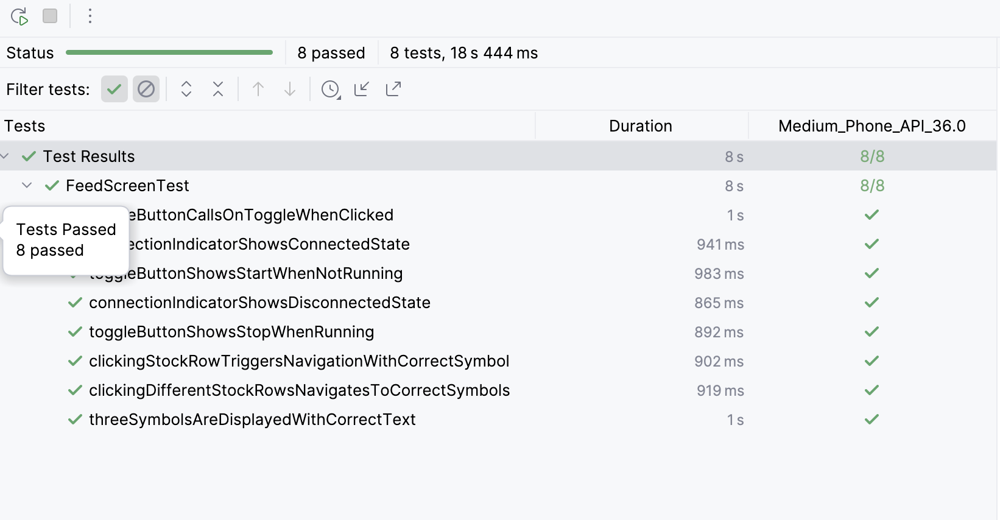

# stockPriceTracker
## 📱 App Preview

## ✨ Features

- Real-time stock price updates via WebSocket
- Single source of truth with StateFlow
- MVVM architecture
- Navigation Compose (Feed → Details)
- Start/Stop live feed
- Connection status indicator

### Unit tests

Tests for `StockRepository` business logic using JUnit4 and a `FakeWebSocketManager`.
No Android dependencies — runs on the local JVM.

---

## Compose UI Tests

Tests for the Feed screen UI using Compose Testing APIs.
Runs on a connected device or emulator.
